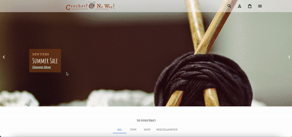

# 🧶🧶🧶🧶 Crochet-E-Commerce 🧶🧶🧶🧶

Welcome to Crochet? No Way!, an e-commerce site for all your crochet needs.



## 🧶 Technologies Used 🧶

This project is built using the following technologies:

- [React](https://reactjs.org/): A JavaScript library for building user interfaces.
- [Redux Toolkit](https://redux-toolkit.js.org/): The official, opinionated, batteries-included toolset for efficient Redux development.
- [Strapi](https://strapi.io/): A headless CMS that provides a customizable backend for managing content.
- [Stripe](https://stripe.com/): A secure and developer-friendly way to accept payments online.
- [Node.js](https://nodejs.org/): A JavaScript runtime built on Chrome's V8 JavaScript engine.
- [npm](https://www.npmjs.com/) / [Yarn](https://yarnpkg.com/): Package managers for installing JavaScript libraries and managing dependencies.
-Adobe Illustrator and Adobe Fresco for custom logo design.
Additional libraries and tools may be found in the project's dependencies listed in the `package.json` files for the server and client.


## 🧶 Getting Started 🧶

To run the app, follow these steps:
1. Obtain a secret key from [Stripe](https://stripe.com/).
2. Set up your environment variables:
   - In the `server` folder, create a `.env` file.
   - Add your Stripe secret key to the `.env` file using the following format:
     ```
     STRIPE_SECRET_KEY=your_secret_key_here
     ```

3. Navigate to the `server` folder and run:
`npm run start`
4. Navigate to the `client` folder and run:
`npm run start`


## 🧶 Features 🧶

- Home page carousel
- Display products using a Strapi backend
- Filter products
- Add products to your cart
- Checkout using a Stripe API call

Please note that the website is not currently connected to a bank account and does not list real products.


### 🧶 Stripe Checkout 🧶

For Stripe integration, refer to the [Stripe Checkout Quickstart](https://stripe.com/docs/checkout/quickstart) guide. 

You can use the following test cards for simulation:

- Payment succeeds: `4242 4242 4242 4242`
- Payment requires authentication: `4000 0025 0000 3155`
- Payment is declined: `4000 0000 0000 9995`


### 🧶 Endpoints 🧶

- `GET /api/:pluralApiId`: Get a list of entries
- `POST /api/:pluralApiId`: Create an entry
- `GET /api/:pluralApiId/:documentId`: Get an entry
- `PUT /api/:pluralApiId/:documentId`: Update an entry
- `DELETE /api/:pluralApiId/:documentId`: Delete an entry

## 🧶 Improvements to be made 🧶
-Add .env setup instructions to readme

## 🧶 Known Bugs 🧶
### Preventing Duplicate Items

To prevent adding duplicate items to the cart, a feature is implemented.

## License

MIT License

Copyright (c) (2023) Natalie Benjes

Permission is hereby granted, free of charge, to any person obtaining a copy
of this software and associated documentation files (the "Software"), to deal
in the Software without restriction, including without limitation the rights
to use, copy, modify, merge, publish, distribute, sublicense, and/or sell
copies of the Software, and to permit persons to whom the Software is
furnished to do so, subject to the following conditions:

The above copyright notice and this permission notice shall be included in all
copies or substantial portions of the Software.

THE SOFTWARE IS PROVIDED "AS IS", WITHOUT WARRANTY OF ANY KIND, EXPRESS OR
IMPLIED, INCLUDING BUT NOT LIMITED TO THE WARRANTIES OF MERCHANTABILITY,
FITNESS FOR A PARTICULAR PURPOSE AND NONINFRINGEMENT. IN NO EVENT SHALL THE
AUTHORS OR COPYRIGHT HOLDERS BE LIABLE FOR ANY CLAIM, DAMAGES OR OTHER
LIABILITY, WHETHER IN AN ACTION OF CONTRACT, TORT OR OTHERWISE, ARISING FROM,
OUT OF OR IN CONNECTION WITH THE SOFTWARE OR THE USE OR OTHER DEALINGS IN THE
SOFTWARE.